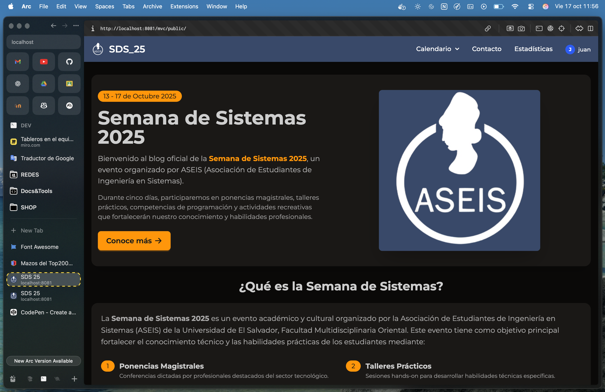

# SDS 25 

>[!NOTE]
> Para poder ver el registro de usuario debe de abrir el proyecto
> en diferentes navegadores o en modo incógnito para que se
> registre una nueva visita. Y se registran las visitas pero
> tambien los usuarios

## Descripción General

Proyecto web para registrar y analizar visitas de usuarios anónimos y registrados, asegurando privacidad y anonimato.

 ## Comando para iniciar el proyecto

 ```bash
 docker-compose up -d --build
 ```

 recuerda que los puertos que estan en la docker-compose deben estan libres en tu maquina local

 ## Vistas del proyecto

### Landing Page
Esta es la pagina principal del proyecto donde se puede navegar a las diferentes secciones del mismo.
- Página principal: `http://localhost:8081/mvc/public/`


### Calendario
Esta sección permite visualizar el calendario de SDS25.
- Página del calendario: `http://localhost:8081/mvc/public/calendario`


### Calendario blog


- Página del calendario blog: `http://localhost:8081/mvc/public/calendario_blog`


> [!IMPORTANT]
> Para poder ver las demás vistas despliega el dropdown que está en el navbar o desliza hasta abajo de la página principal.

## Funcionamiento del registro de <span style="color:#48e">visitas</span>

Sistema web que registra una sola visita por sesión de navegador, diferenciando entre visitantes anónimos y usuarios registrados. Las visitas se asocian a un `visitor_id` único y, si el usuario se registra, a su nombre.

## Estructura de Base de Datos

**tbl_usuario**: id_usuario, visitor_id, nombre, f_registro, visitas
**tbl_visitas**: id_visita, id_usuario (FK, puede ser NULL), visitor_id, fecha

## Métricas principales

- Total de visitas
- Visitantes únicos
- Usuarios registrados
- Visitas hoy y esta semana

## Privacidad

- No se almacenan IPs ni datos sensibles
- visitor_id es anónimo
- El nombre solo si el usuario lo registra

## Cómo probar

1. Visita `http://localhost/public/`
2. Navega entre páginas (solo cuenta 1 visita por sesión)
3. Regístrate en "Contacto"
4. Consulta estadísticas en `/estadisticas`

## Archivos clave

- `lib/Database.php`: Crea BD y tablas
- `app/models/Visita.php`: Lógica de tracking
- `app/init_tracking.php`: Inicializa sistema
- `app/views/contacto.php`: Registro de usuario
- `app/views/estadisticas.php`: Métricas

---
Desarrollado para Semana de Sistemas 2025 por Juan Sandoval
